# UK Gas Reliance vs Renewables Analysis

**Industry:** Energy and Utilities
**Data period:** April 2025 to March 2026

> **A note on the data:** every figure in this project comes from real, publicly available data from the National Grid ESO Carbon Intensity website, covering half hourly UK electricity generation across twelve consecutive months. Nothing here is simulated or estimated. Every number quoted in this README was checked directly against the underlying SQL and Power BI output before being written down.

---

## Report Preview

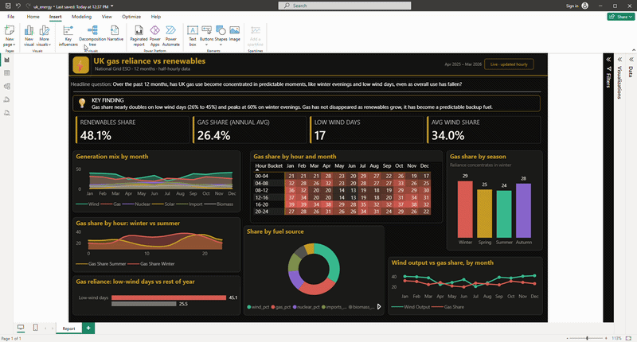

---

## TL;DR

A one page Power BI report analysing over 17,000 half hourly UK generation records across 12 months, built on a cleaned dataset with Python, explored through SQL, and finished with a custom gold and black themed Power BI report, KPI cards, and a heatmap.

**Key findings:**

- Gas made up 26.4 per cent of UK generation on average across the year, but that average hides a much sharper pattern underneath
- On the 17 days when wind output fell below 10 per cent, gas share nearly doubled to 45.1 per cent of generation, compared with 25.5 per cent on a typical day
- During a sustained low wind spell from 12 to 17 October 2025, gas share stayed above 55 per cent for six consecutive days, peaking at 64.5 per cent on 13 October, the single highest gas reliant day of the year
- Gas reliance also peaks seasonally, 29 per cent in winter against 24 per cent in summer, and by time of day, rising as high as 60 per cent between 5pm and 7pm in December and January
- As wind and solar capacity has grown, gas has not disappeared from the UK's energy mix. It has instead concentrated into a smaller number of predictable, high reliance moments rather than a steady year round dependency

---

## Project Files

| File | Description | Link |
|---|---|---|
| Raw data | Original, unmodified 12 month half hourly export from the National Grid ESO Carbon Intensity website | [Raw Data folder](./Raw%20Data) |
| Python cleaning, analysis, and MySQL upload | Fetches, cleans, and derives all time based columns, explores the data with charts, then loads the cleaned data directly into MySQL | [uk_generation_mix_cleaned.ipynb](./uk_generation_mix_cleaned.ipynb) |
| Cleaned dataset | The final cleaned CSV output, also loaded into MySQL | [uk_generation_mix_cleaned.csv](./uk_generation_mix_cleaned.csv) |
| SQL queries | All business question queries used to answer the report's core questions | [uk_generation_mix_sql.sql](./uk_generation_mix_sql.sql) |
| Power BI report | Full one page .pbix file, open in Power BI Desktop to explore | [Download .pbix](./uk_energy.pbix) |

---

## Why I Built This Project

Energy is one of those topics everyone has an opinion on, especially in the UK, where renewables and gas dependency are constantly in the news, but the public rarely sees the actual half hourly numbers behind the headlines. I wanted to work with a genuinely real, live, government adjacent dataset rather than a pre cleaned tutorial file, and use it to answer a specific, open question: **as wind and solar capacity has grown, has the UK's reliance on gas actually gone down, or has it just moved to more concentrated, predictable moments?**

I deliberately scoped this to a single 12 month period rather than several years, so the project could go deep on patterns within a year, seasonally, by seasonm by day, and by hour, rather than spreading thin across a longer trend. The answer turned out to be more interesting than a simple yes or no. Gas share has fallen on average, but it has not disappeared. It has concentrated into specific, identifiable conditions, low wind days, winter evenings, and one real six day low wind spell in October that I was able to trace directly in the data.

The goal throughout was to give an honest account of what the data actually shows, including checking my own assumptions along the way, such as confirming the 17 low wind days genuinely represented a small, meaningful minority of the year rather than an arbitrary cut.

---

## Project Overview

A data analysis project looking at UK gas reliance and renewable generation between April 2025 and March 2026. Built for a portfolio piece using real National Grid ESO Carbon Intensity data, working through the full pipeline: raw data, Python cleaning, MySQL, SQL analysis, and a one page interactive Power BI report.

The project covers **17,012 half hourly generation records** across **12 consecutive months**, spanning every fuel type in the UK generation mix, gas, wind, solar, nuclear, biomass, hydro, coal, and imports.

The core question: as renewables have grown, has UK gas reliance genuinely fallen, or has it simply become more concentrated. The answer is both. The annual average has fallen, but gas reliance now spikes sharply and predictably during specific conditions.

---

## Insights

#### Datasets

- The raw dataset can be found in the `Raw Data` folder
- The cleaned dataset, `uk_generation_mix_cleaned.csv`, is produced by the Python notebook below and loaded directly into MySQL from within the same notebook

#### Data Cleaning and Analysis

- The full Python cleaning, exploratory work, and MySQL loading step are all in [uk_generation_mix_cleaned.ipynb](./uk_generation_mix_cleaned.ipynb)
- The SQL queries used to answer all business questions are in [uk_generation_mix_sql.sql](./uk_generation_mix_sql.sql)
- The finished one page Power BI report can be found in this repository as a .pbix file

---

## Tools and Technologies

| Category | Tools |
|---|---|
| Programming and cleaning | Python (Pandas, Matplotlib), Jupyter Notebook |
| Database management | MySQL, SQLAlchemy, PyMySQL |
| Visualisation and reporting | Power BI |
| Data storage | CSV files |
| Version control | GitHub |

---

## Project Phases

---

### Phase 1: Data Collection

Source data was taken directly from the [National Grid ESO Carbon Intensity website](https://carbonintensity.org.uk/), a free public data source requiring no account or key, filtered and scoped deliberately to keep the project focused:

- **Time range:** 1 April 2025 to 31 March 2026, 12 consecutive months, half hourly resolution
- **Data retrieved:** the percentage generation mix by fuel type for every half hour period across the year
- **Collection method:** the website only allows data to be retrieved in 14 day windows at a time, so the full 12 month pull was built in Python as a loop across roughly 26 sequential requests, then combined into a single dataframe

This produced a single raw CSV, `uk_generation_mix_12mo.csv`, covering 17,012 half hourly rows across 11 original columns, `from`, `to`, and the percentage share of biomass, coal, imports, gas, nuclear, other, hydro, solar, and wind. This raw file sits in the `Raw Data` folder in this repository.

---

### Phase 2: Data Cleaning, Analysis, and MySQL Upload (Python and Pandas)

**Notebook:** [uk_generation_mix_cleaned.ipynb](./uk_generation_mix_cleaned.ipynb)

This single notebook covers the full Python side of the project: cleaning the raw exported data, deriving every time based column, exploring the data with charts, and finally loading the cleaned result straight into MySQL. Keeping this in one notebook meant the cleaned dataframe could be pushed into MySQL directly with `pandas.to_sql()`, without needing to re read a CSV in a separate file first.

Before any analysis, the raw exported data needed genuine cleaning, most notably a subtle timezone bug that would have blocked the MySQL load entirely if left unfixed.

**Renaming columns for clarity**

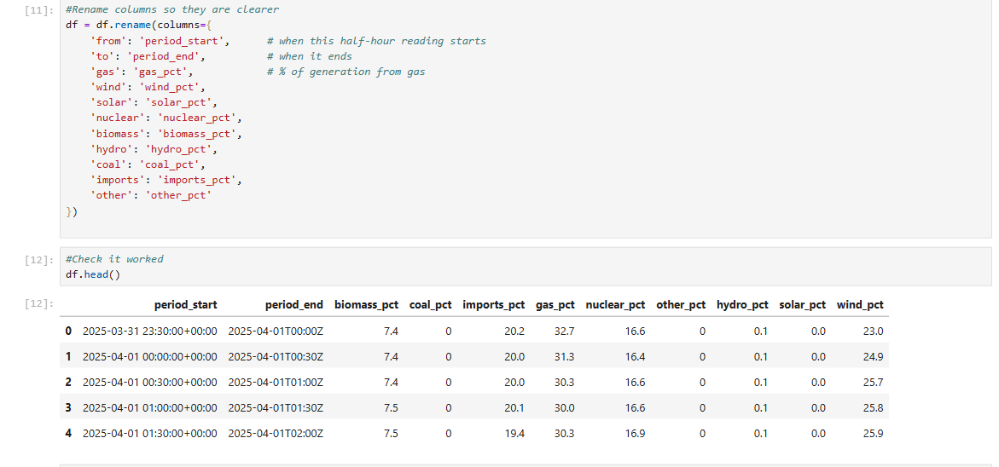

Raw column names like `from` and `gas` were renamed to `period_start` and `gas_pct`, so every fuel column is unambiguous as a percentage the moment you see it.

**Converting to real datetime values**

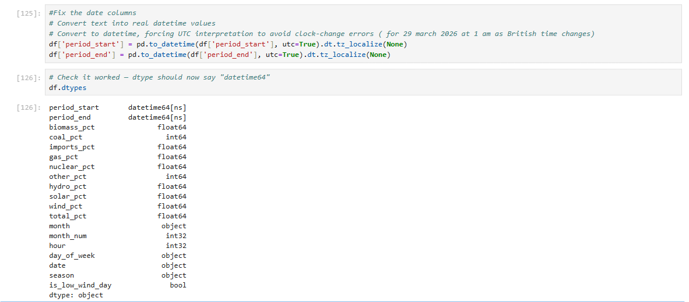

`period_start` and `period_end` were converted from plain text into proper datetime values, a required step before any month, hour, or day of week grouping could happen.

**Checking for missing or broken values**

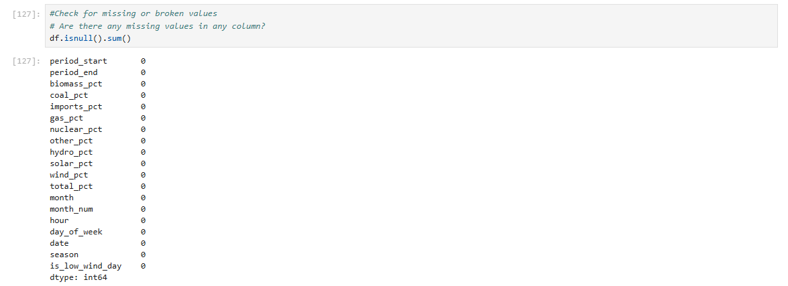

Zero missing values across all 11 original columns. A second check confirmed every row's fuel percentages summed to close to 100 per cent, between 99.8 and 100.2, accounting for normal rounding.

**Adding derived time columns**

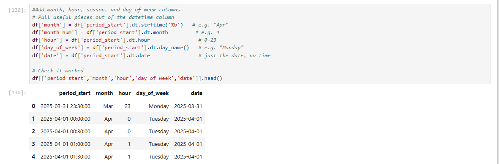

Month, month number, hour, day of week, date, and a UK meteorological season label were all added as new columns, ready for grouping in every later chart and query.

**Flagging low wind days**

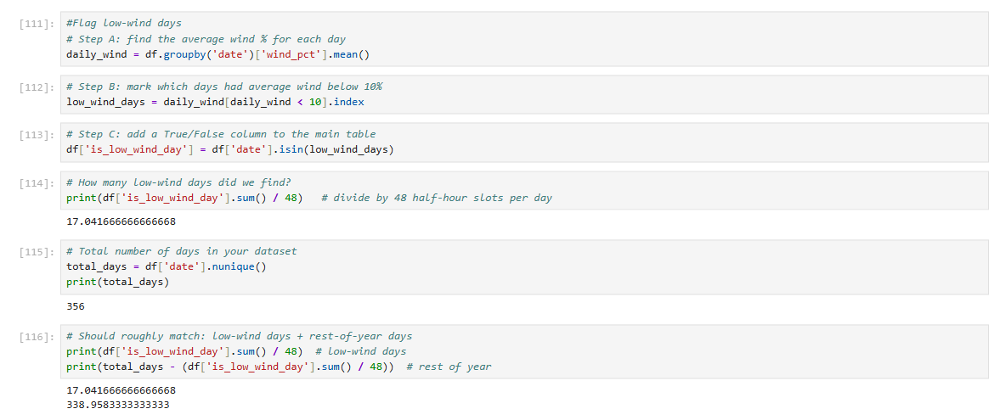

A day was flagged as a low wind day if its average wind output across all 48 half hour periods fell below 10 per cent. This produced **17 low wind days**, out of **356 total days**, roughly 5 per cent of the year, confirmed with a direct count check before being used anywhere else in the project.

**A first look at the data with simple Matplotlib charts**

With the data cleaned and every derived column in place, three quick charts were built directly in the notebook to sanity check the story before moving on to SQL or Power BI.

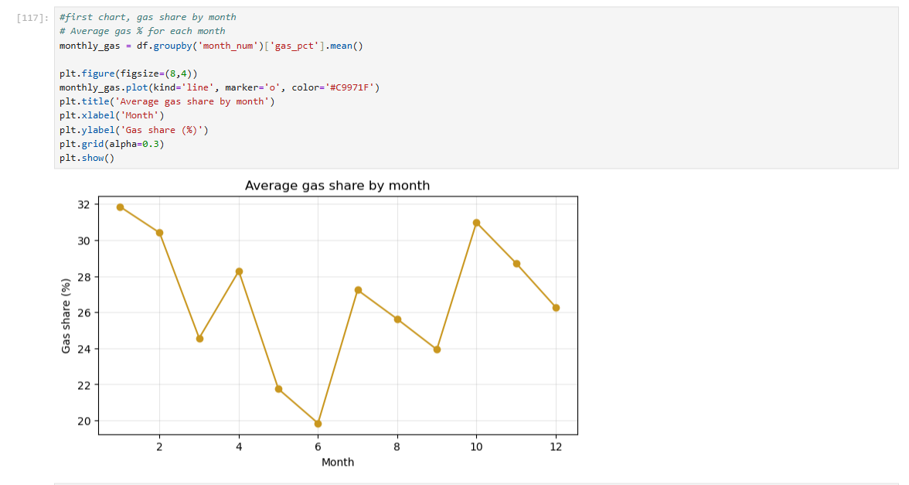

Gas share by month, plotted as a simple line chart, immediately showed the seasonal curve later confirmed in SQL, peaking around January at close to 32 per cent and dropping to its lowest near June at just under 20 per cent.

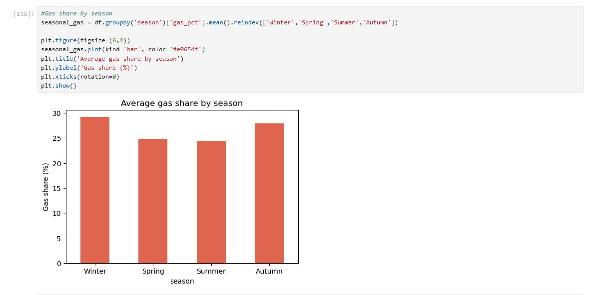

The same pattern grouped by season as a bar chart, winter and autumn both sitting noticeably above spring and summer.

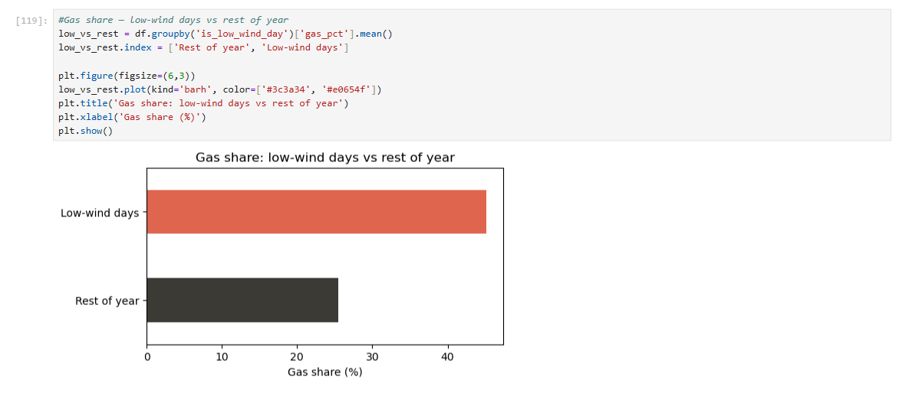

The single most important chart in the whole project, gas share nearly doubling on low wind days compared with the rest of the year, built here in Python before this same result was later verified independently in both SQL and Power BI.

**Writing up the key finding directly in the notebook**

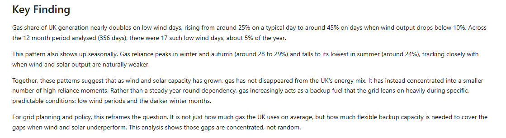

With the pattern confirmed across all three charts, the headline finding was written up as a Markdown cell directly in the notebook, stating the core numbers plainly, gas share nearly doubling from 25.5 to 45.1 per cent on the 17 low wind days identified earlier, before this same wording was carried through into the Power BI report itself. Writing the finding immediately after the charts that prove it, rather than only at the very end of the project, kept the analysis honest about exactly what the data showed at each stage.

**Fixing a genuine timezone bug**

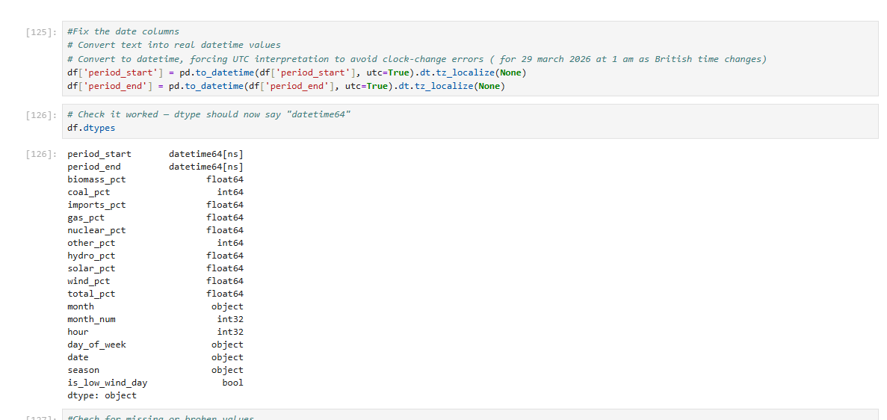

While loading the cleaned data into MySQL, a single row failed with an "incorrect datetime value" error for 29 March 2026 at 1am. This is the exact date and hour the UK clocks spring forward for British Summer Time, meaning that specific local time technically does not exist. The fix was to force every timestamp to be interpreted as UTC first, then strip the timezone label afterwards, rather than trying to store an ambiguous local time directly.

**Loading into MySQL**

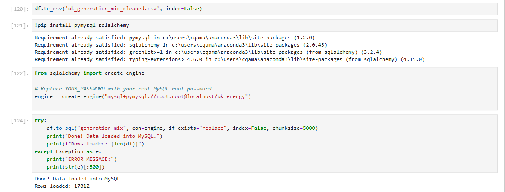

The cleaned dataframe was loaded into a local MySQL database using `pandas.to_sql()` with `sqlalchemy` and `pymysql`, rather than `LOAD DATA INFILE`, which repeatedly hit local file permission restrictions in this environment. Row count in MySQL matched the cleaned dataframe exactly, 17,012 rows.

Final cleaned dataset: **17,012 rows**, 20 columns after all derived fields were added, exported as `uk_generation_mix_cleaned.csv` and loaded directly into MySQL.

---

### Phase 3: Exploratory Data Analysis (SQL)

**Queries:** [uk_generation_mix_sql.sql](./uk_generation_mix_sql.sql)

Each query below was written to answer a specific business question, and every result was cross checked directly against both the Python analysis and the Power BI report before being finalised.

---

**Business question: What's the average gas share by month?**

```sql
SELECT month, month_num, ROUND(AVG(gas_pct), 1) AS avg_gas_pct
FROM generation_mix
GROUP BY month, month_num
ORDER BY month_num;
```

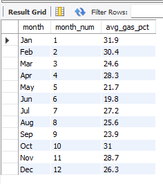

Gas share peaks in January at 31.9 per cent and falls to its lowest in June at 19.8 per cent, a clear seasonal curve rather than random monthly noise.

---

**Business question: What's the average gas share by season?**

```sql
SELECT season, ROUND(AVG(gas_pct), 1) AS avg_gas_pct
FROM generation_mix
GROUP BY season
ORDER BY FIELD(season, 'Winter', 'Spring', 'Summer', 'Autumn');
```

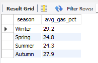

Winter leads at 29.2 per cent, followed by Autumn at 27.9 per cent, Spring at 24.8 per cent, and Summer lowest at 24.3 per cent, roughly a 5 point swing between the highest and lowest season.

---

**Business question: How much higher is gas share on low wind days compared with the rest of the year?**

```sql
SELECT
    is_low_wind_day,
    ROUND(AVG(gas_pct), 1) AS avg_gas_pct,
    COUNT(DISTINCT date) AS num_days
FROM generation_mix
GROUP BY is_low_wind_day;
```

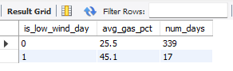

Gas share nearly doubles on low wind days, 45.1 per cent against 25.5 per cent for the rest of the year, confirmed across 17 low wind days out of 339 remaining days. This is the core finding the entire project is built around.

---

**Business question: What does gas share look like by hour of day?**

```sql
SELECT hour, ROUND(AVG(gas_pct), 1) AS avg_gas_pct
FROM generation_mix
GROUP BY hour
ORDER BY hour;
```

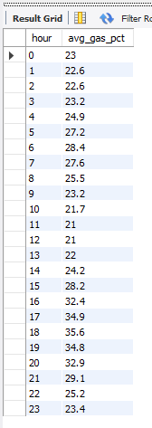

Gas share follows a double peak pattern across the day, rising through the morning, dipping slightly around midday as solar output picks up, then rising sharply again into the evening, consistent with typical UK electricity demand patterns.

---

**Business question: Which were the highest gas reliance days of the year, and what caused them?**

```sql
SELECT date, ROUND(AVG(gas_pct), 1) AS avg_gas_pct
FROM generation_mix
GROUP BY date
ORDER BY avg_gas_pct DESC
LIMIT 5;
```

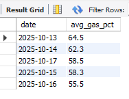

All five of the highest gas reliance days of the year fall within a single week, 13 to 17 October 2025, peaking at 64.5 per cent on 13 October. A follow up query confirmed this was a genuine, sustained low wind spell rather than a data anomaly.

```sql
SELECT date,
       ROUND(AVG(gas_pct), 1) AS avg_gas_pct,
       ROUND(AVG(wind_pct), 1) AS avg_wind_pct
FROM generation_mix
WHERE date BETWEEN '2025-10-12' AND '2025-10-18'
GROUP BY date
ORDER BY date;
```

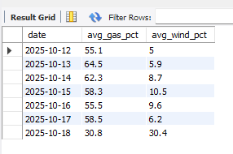

Wind output collapsed to between 5 and 10.5 per cent for six consecutive days, 12 to 17 October, and gas share rose in direct response, staying above 55 per cent throughout. The moment wind recovered to 30.4 per cent on 18 October, gas share fell straight back down to 30.8 per cent, a clean, direct, real world example of the pattern behind this entire project.

---

**Business question: How does gas share change month over month?**

```sql
SELECT
    month_num,
    month,
    ROUND(AVG(gas_pct), 1) AS avg_gas_pct,
    ROUND(AVG(gas_pct) - LAG(AVG(gas_pct)) OVER (ORDER BY month_num), 1) AS change_vs_prev_month
FROM generation_mix
GROUP BY month_num, month
ORDER BY month_num;
```

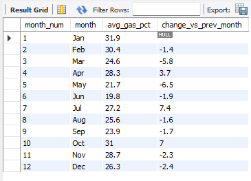

Using a window function to calculate month over month change reveals the sharpest single month swings occur moving into and out of the summer trough, July jumping 7.4 points from June, and October jumping 7 points from September, both consistent with rapid seasonal changes in wind and solar output.

---

### Phase 4: Advanced Analysis and Visual Design (Power BI)

Moved into Power BI for the visual and interactive work. All screenshots are in the `images` folder.

---

## Report: UK Gas Reliance vs Renewables

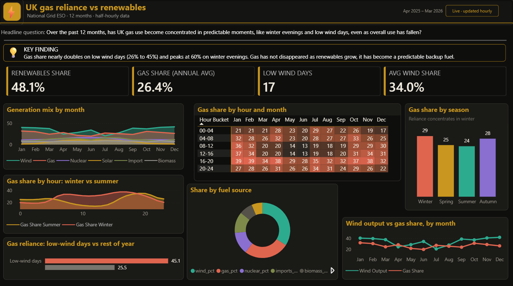

This is a single page report, designed to answer the project's headline question within the first ten seconds, then support it with progressively more detailed visuals underneath.

**Headline question and key finding banner** A callout stating the report's central question in plain English, has UK gas use become concentrated in predictable moments, like winter evenings and low wind days, even as overall use has fallen, followed immediately by the answer: gas share nearly doubles on low wind days, from 26 to 45 per cent, and peaks at 60 per cent on winter evenings, and gas has not disappeared as renewables grow, it has become a predictable backup fuel.

**Four KPI cards** Renewables share at 48.1 per cent, gas share annual average at 26.4 per cent, low wind days at 17, and average wind share at 34.0 per cent, each pulled live from Power BI measures built directly on the raw generation data, not pre calculated in SQL.

**Generation mix by month, stacked area chart** All eight fuel types stacked across the year, showing wind's share dipping over summer and early autumn while gas visibly rises to fill the gap.

**Gas share by hour, winter vs summer, line chart** Two lines built from DAX measures filtered by season, showing winter's sharp evening spike reaching around 60 per cent between 5 and 7pm, against a much flatter summer pattern staying near 20 to 25 per cent throughout the day.

**Gas reliance, low wind days vs rest of year, bar chart** The report's core finding as a single visual, 45.1 per cent against 25.5 per cent.

**Gas share by season, bar chart** Winter and Autumn both sit noticeably above Spring and Summer, correctly ordered using a custom sort column rather than defaulting to alphabetical order.

**Share by fuel source, donut chart** The full annual generation mix broken down by fuel type, built from a separate unpivoted reference table so the main data model used by every other visual stayed untouched.

**Wind output vs gas share by month, line chart** Wind and gas plotted together across the year, moving in near lock step but in opposite directions, visual proof that gas fills in wherever wind falls short.

**Gas share by hour and month, heatmap matrix** The centrepiece visual of the report. Every hour bucket across every month, shaded from dark brown at low gas reliance through to coral at high gas reliance, using a custom colour scale matching the report's theme. Winter evening cells, particularly December and January between 4pm and 8pm, stand out immediately as the darkest, highest reliance cells on the entire grid, a single glance proof of the report's central finding.

**Report outcome:** this report proves, using real half hourly data, real SQL aggregation, and live Power BI measures throughout, that UK gas reliance has not disappeared as renewables have grown. It has concentrated into specific, identifiable, and largely predictable conditions, low wind days, winter evenings, and one genuine multi day low wind spell that can be pinpointed directly in the data.

---

## Skills This Project Demonstrates

- End to end data pipeline construction, from a public data website through Python cleaning, MySQL loading, SQL analysis, and finally an interactive Power BI report
- Diagnosing and fixing a genuine, non obvious data bug, a British Summer Time clock change producing an invalid datetime value, rather than only working with pre cleaned data
- Data quality verification as a habit, including checking that fuel percentages summed close to 100 per cent, and confirming a top result with a targeted follow up query rather than accepting it at face value
- Exploratory data visualisation in Python with Matplotlib, used to sanity check the core finding before it was ever queried in SQL or built into Power BI
- SQL query writing across aggregation, grouping, window functions, and multi dimensional business questions
- Power BI report design, including a custom theme, DAX measures, calculated and conditional columns, a colour scaled heatmap matrix, and season filtered comparison charts
- Translating raw statistics into a clear, honest, plain English finding, including being upfront about a relatively small sample size, 17 low wind days, rather than presenting it as more robust than it is

---

## Key Findings

- Gas made up 26.4 per cent of UK generation on average across the year, but this average hides a much sharper underlying pattern
- On the 17 days when wind output fell below 10 per cent, gas share nearly doubled to 45.1 per cent, compared with 25.5 per cent for the rest of the year
- A genuine six day low wind spell from 12 to 17 October 2025 pushed gas share above 55 per cent throughout, peaking at 64.5 per cent, the single highest gas reliant day of the year
- Gas reliance peaks seasonally in winter at 29.2 per cent, and by time of day, reaching as high as 60 per cent between 5pm and 7pm in December and January
- As wind and solar capacity has grown, gas has not disappeared from the UK's energy mix. It has become a concentrated backup fuel used at specific, predictable times rather than a steady year round dependency

---

## Limitations

- The low wind day threshold, below 10 per cent average daily wind output, is a reasonable but somewhat arbitrary cut off. A different threshold, such as 15 per cent, would change the exact day count and average, though the underlying pattern would very likely hold
- Only 17 low wind days occurred in this 12 month period, a genuinely small sample. The finding is directionally strong and consistent with the seasonal and hourly patterns seen elsewhere in the data, but a longer multi year dataset would allow this to be tested with greater statistical confidence
- This project covers UK wide generation mix only. It does not include absolute demand figures in gigawatts, regional breakdowns, or wholesale price data, all of which would need to be sourced separately from the ESO Data Portal or Ofgem to extend this analysis further

---

## What Could Be Added With More Time

- Regional generation and gas reliance data, to see whether the low wind and winter evening pattern found here holds true consistently across all UK regions, or is more pronounced in some than others
- Absolute demand data in gigawatts alongside the percentage generation mix used here, to distinguish periods of high gas share driven by low wind from periods driven by high overall demand
- Wholesale gas and electricity price data, to estimate the actual cost impact of these high reliance periods, rather than only measuring them as a share of generation
- Extending the dataset across multiple years, to test whether the 10 per cent low wind threshold and the resulting findings remain stable over a longer time period

---

## Data Source

National Grid ESO, [Carbon Intensity website](https://carbonintensity.org.uk/), generation mix and carbon intensity data, freely available under an open licence.

---

## About Me

I built this report as part of my own practice in data analysis and business intelligence, with a particular interest in energy and sustainability data. I am currently looking for opportunities in London within data analysis or business intelligence roles, and I would welcome the chance to talk through this project, the choices behind it, or any part of the underlying data model.

Feel free to open the .pbix file yourself, explore the report, and reach out with any questions or feedback.


---
## Contact

**Sana Aziz**

Data Analyst | SQL • Excel • Power BI • Tableau • Python

London, UK
[](https://www.linkedin.com/in/sana-aziz-analyst-uk/)

